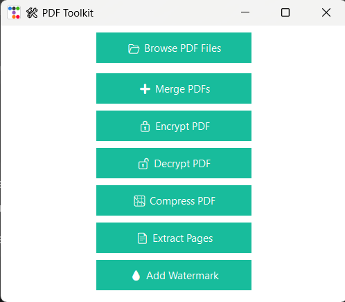
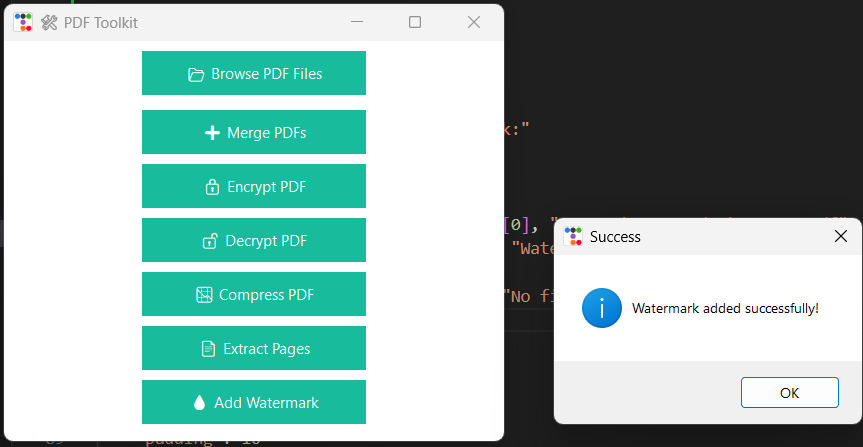

By - Rudra Mahendra Sangewar
 
MMCOE,pune
# 🛠️ PDF Toolkit

A powerful PDF manipulation desktop app built using Python and Tkinter (with ttkbootstrap).  
It supports merging, splitting, compressing, encrypting, decrypting, extracting pages, reordering, and adding watermarks to PDFs.

---

## 📌 Features

- 📂 Browse & select multiple PDFs
- ➕ Merge PDFs
- 🔒 Encrypt with password
- 🔓 Decrypt password-protected PDFs
- 📉 Compress PDFs
- 📄 Extract specific pages
- 🔁 Reorder pages
- 💧 Add watermark (diagonal text)
- 🎨 User-friendly GUI with themed buttons

---

## 🧰 Tech Stack

- Python 3.11
- PyPDF2
- ttkbootstrap
- ReportLab

---

## 🚀 How to Run

1. Clone the repo  
   `git clone https://github.com/Rudra-Sangewar/pdf-toolkit.git`

2. Install dependencies  
   `pip install -r requirements.txt`

3. Run the app  
   `python fancy_gui.py`

---

## 📸 Screenshots

### 🖼️ Main GUI

### 🧪 Sample Output

---

## 👤 Author

**Rudra Sangewar**  
Final Year ENTC Student — Pune  

---

## ⭐️ Show Some Love

If you like this project, give it a ⭐ on GitHub 🙌

